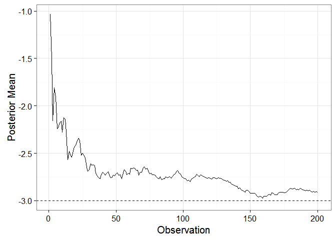
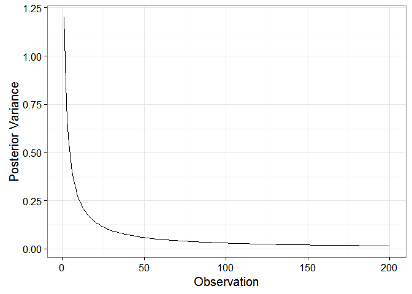
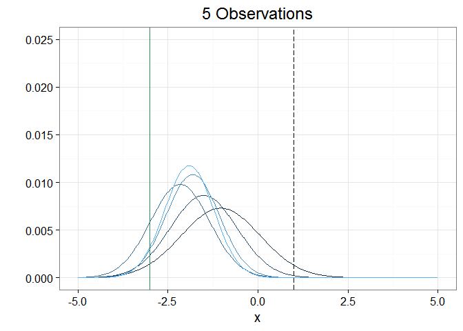
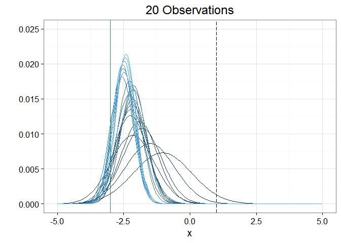
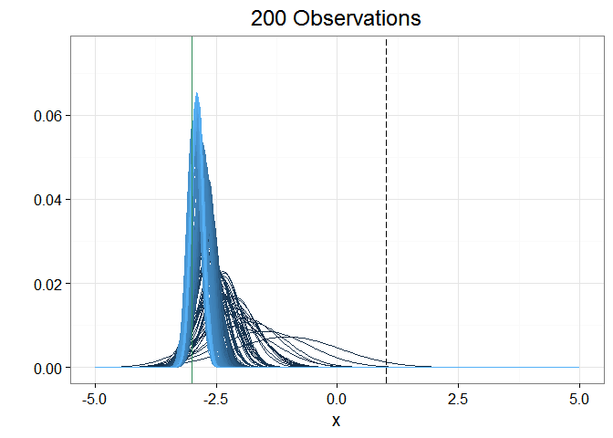
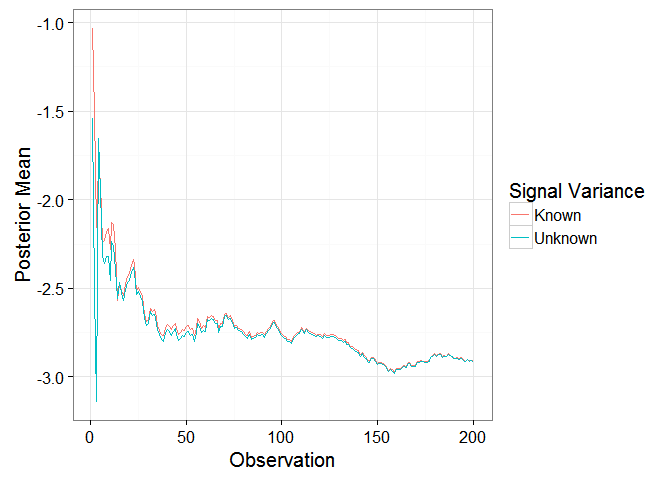
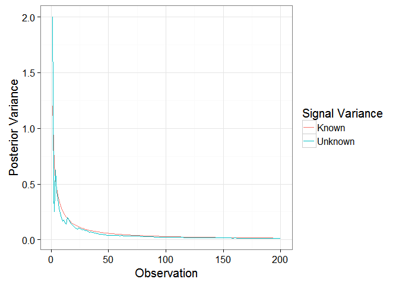

# Bayesian Updating
Wayne Taylor  
May 31, 2016  

## Modeling Customer Learning

One way to model customer learning is to use a Bayesian updating process. The idea is that a customer learns about the true mean of an underlying normal distribution by taking draws from that distribution. Before taking any draws, the customer has a prior belief on the mean and there is uncertainty in that belief. As more draws are experienced their updated beliefs will converge to the true mean and their uncertainty will shrink.

Below I illustrate how this process works using a simple example. The full code is available in the `BayesianUpdating.R` file.

## Some Notation

There are many ways the Bayesian updating process is presented and while the notation is often different the results are the same (or at least they should be). Note that sometimes the precision rather than the variance is presented, where the precision is just the inverse of the variance. In the example below I use the following notation:

* $\mu_0$: prior mean
  
* $\sigma^2_0$: prior variance
  
* $\mu_n$: posterior mean at time $n$
  
* $\sigma^2_n$: posterior variance at time $n$

The presentation here is from [Wikipedia](https://en.wikipedia.org/wiki/Conjugate_prior). Note that we assume the signal variance $\sigma^2$ is known, an assumption that will be relaxed later.

Posterior Mean:
 
$$\mu_n =  \left(\frac{\mu_0}{\sigma_0^2} + \frac{\sum_{i=1}^nx_i}{\sigma^2} \right) \bigg/  \left( \frac{1}{\sigma_0^2} + \frac{n}{\sigma^2} \right) $$

Posterior Variance:
$$\sigma^2_n = \left( \frac{1}{\sigma_0^2} + \frac{n}{\sigma^2} \right)^{-1} $$
 

The formula is easily converted into R:


```r
bayesianUpdating1 = function(mu_0,sigma_0,x,sigma2){
#Posterior Mean and Variance as a function of the prior mean, prior variance, signals, and true signal variance  
  
  n       = length(x)
  postMu  = (mu_0/sigma2_0+sum(x)/sigma2)/(1/sigma2_0+n/sigma2)
  postVar = 1/(1/sigma2_0+n/sigma2)
  
  t(c(postMu,postVar))
  
}
```


## An Example

In this example the posterior mean and variance is updated after each signal so that we can observe how the posterior beliefs converge to the truth. The customer observes signals drawn from a normal distribution with mean equal to -3 and a variance of 3. The prior mean is 1 with an uncertainty (prior variance) of 2.


```r
set.seed(1)
n = 200      # observations
mu_0 = 1     # prior mean
sigma2_0 = 2 # prior variance
mu = -3      # true mean
sigma2 = 3   # signal variance
x = rnorm(n,mu,sqrt(sigma2))

#store the output
out1 = data.frame(postMu=NA,postVar=NA)
for(i in 1:n){
  
  out1[i,1] = (mu_0/sigma2_0+sum(x[1:i])/sigma2)/(1/sigma2_0+i/sigma2) #Posterior Mean
  out1[i,2] = 1/(1/sigma2_0+i/sigma2)                                  #Posterior Variance
  
}
```

Below I plot the posterior mean and variance over time. The prior mean hones in on the true value and the uncertainty declines exponentially.


```r
library(ggplot2)
qplot(x=1:n,y=out1[,1],geom="line")+theme_bw(15)+xlab("Observation") + ylab("Posterior Mean") + geom_hline(yintercept = mu,linetype="dashed")
```

<!-- -->

```r
qplot(x=1:n,y=out1[,2],geom="line")+theme_bw(15)+xlab("Observation") + ylab("Posterior Variance")
```

<!-- -->

Another way to visualize this is to show how the shape of the updated normal distribution changes with more observations. To do this, I calculate the density of posterior distribution after each signal.


```r
library(reshape2)
xseq  = seq(-5,5,length.out=500)
denx = apply(out1,1, function(x) dnorm(xseq, mean = x[1], sd = sqrt(x[2])))
denx = t(t(denx)/rowSums(t(denx))) #Proper way to normalize (/colSums won't work as expected)
denx.m = melt(denx)                #Put into long format
denx.m$Var1 = rep(xseq,n)
```

Now we can compare the densities after 5, 20, and all 200 signals. The prior mean is represented by the vertical dashed line and the true mean is represented by the solid dark green line. As the customer experiences more signals, the posterior distribution approaches the true mean and uncertainty is reduced.


```r
nsub=5
ggplot(subset(denx.m,Var2 <= nsub),aes(x = Var1, y = value, group = Var2,color=Var2)) + geom_line() + 
  scale_colour_gradient(limits=c(1,nsub))+theme_bw(15)+theme(legend.position="none")+
  geom_vline(xintercept = mu_0,linetype = "longdash") + geom_vline(xintercept = mu,color="sea green") + xlab("x") + ylab("") + ylim(c(0,.025))+ggtitle("5 Observations")
```

<!-- -->

```r
nsub=20
ggplot(subset(denx.m,Var2 <= nsub),aes(x = Var1, y = value, group = Var2,color=Var2)) + geom_line() + 
  scale_colour_gradient(limits=c(1,nsub))+theme_bw(15)+theme(legend.position="none")+
  geom_vline(xintercept = mu_0,linetype = "longdash") + geom_vline(xintercept = mu,color="sea green") + xlab("x") + ylab("") + ylim(c(0,.025))+ggtitle("20 Observations")
```

<!-- -->

```r
nsub=200
ggplot(subset(denx.m,Var2 <= nsub),aes(x = Var1, y = value, group = Var2,color=Var2)) + geom_line() + 
  scale_colour_gradient(limits=c(1,nsub))+theme_bw(15)+theme(legend.position="none")+
  geom_vline(xintercept = mu_0,linetype = "longdash") + geom_vline(xintercept = mu,color="sea green") + xlab("x") + ylab("") + ylim(c(0,.075))+ggtitle("200 Observations")
```

<!-- -->

## Unknown Variance

The method above assumes that the customer knows the signal variance. To relax this assumption, a reasonable approach would be to have the customer estimate the variance based on the signals already received.

For computational efficiency, rather than recalculate the mean and variance of all the signals each time a new signal is presented, we can update the mean and variance using the following formulas.

$$\bar{x}_n = \frac{\sum_{i=1}^{n-1} x_i + x_n}{n}$$

$$\sigma^2_n =  \frac{\left(\sigma^2_{n-1} + x_i^2 - \left(\sum_{i=1}^n x_i\right)^2/n\right)}{n-1}$$

It is easy to check these formulas in R:

```r
nx   = length(x)
sumx = sum(x)
ssx  = sum(x^2)

#new signal
sig1  = 2
xpsig = c(x,sig1)

nx   = nx + 1
sumx = sumx + sig1
ssx  = ssx + sig1^2

mean(xpsig);sumx/nx
```

```
## [1] -2.913874
```

```
## [1] -2.913874
```

```r
var(xpsig);(ssx - (sumx*sumx)/nx)/(nx-1)
```

```
## [1] 2.698051
```

```
## [1] 2.698051
```

Now let's implement it. There are only a couple of minor changes that need to be made to the original code. Note that the variance can't be calculated with only one signal, so the posterior variance after the first signal is the same as the prior variance. Also, any references to the true variance need to be replaced with calls to the sample variance.


```r
out2 = data.frame(postMu=NA,postVar=NA)
sumx = 0
ssx  = 0
for(i in 1:n){
  
  sig1 = x[i] #signal
  
  sumx = sumx + sig1
  ssx  = ssx + sig1^2
  xbar = sumx/i
  xvar = (ssx - (sumx*sumx)/i)/(i-1)
  
  if(i==1){
    postMu  = (mu_0 + sig1)/2
    postVar = sigma2_0 
  } else {
    postMu  = (mu_0/sigma2_0+sumx/xvar)/(1/sigma2_0+i/xvar)
    postVar = 1/(1/sigma2_0+i/xvar)
  }
  
  out2[i,1] = postMu
  out2[i,2] = postVar
}
```

The plots below compare the differences between the posterior beliefs when the signal variance is either known or unknown. They eventually converge, but the initial variability in the signals can make it difficult to derive the "correct" posterior beliefs. However, the modeling objectives will dictate which approach is more appropriate.


```r
out1$obs = 1:n
out1$cat = "Known"

out2$obs = 1:n
out2$cat = "Unknown"

outSum   = rbind(out1,out2)

ggplot(outSum,aes(x=obs,y=postMu,group=cat,color=cat)) + geom_line() + theme_bw(15) +
  ylab("Posterior Mean") + xlab("Observation") + scale_color_discrete(name="Signal Variance")
```

<!-- -->

```r
ggplot(outSum,aes(x=obs,y=postVar,group=cat,color=cat)) + geom_line() + theme_bw(15) +
  ylab("Posterior Variance") + xlab("Observation") + scale_color_discrete(name="Signal Variance")
```

<!-- -->
