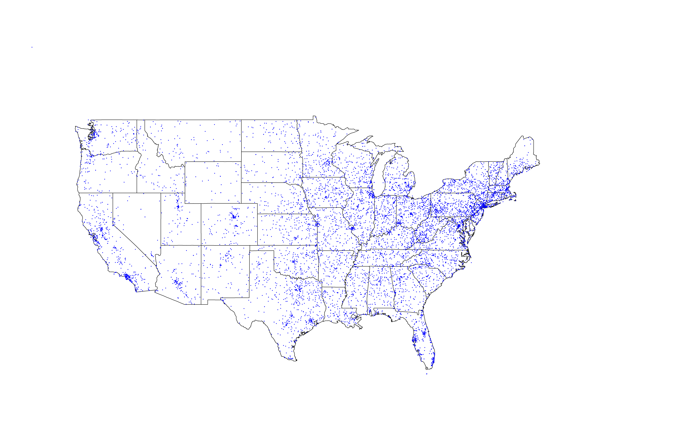
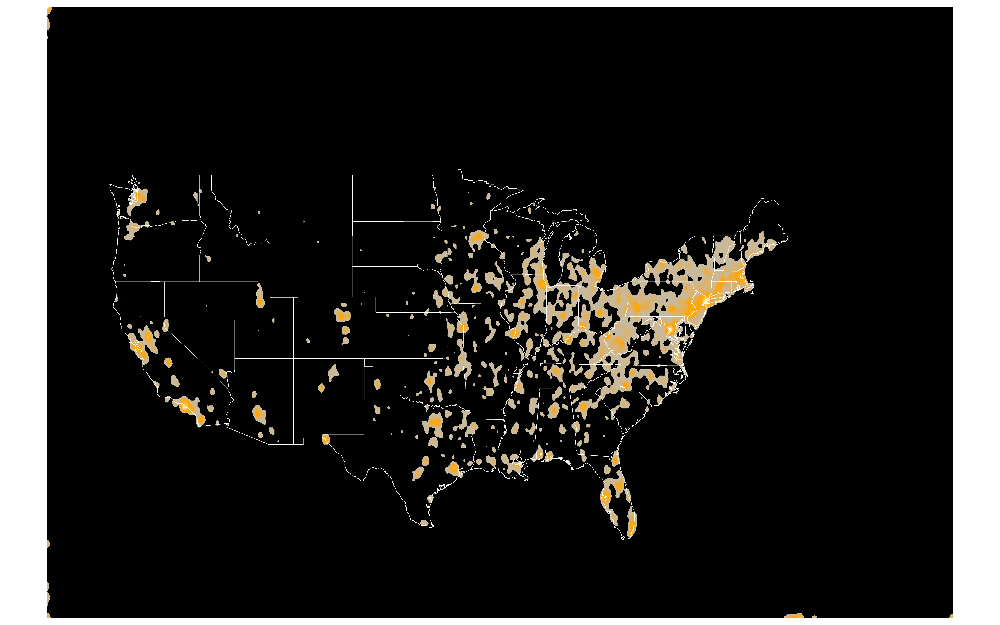

# Mapping your Customers
Wayne Taylor  
May 31, 2016  

## Where are your Customers?

Maps are an easy way to summarize a firm's distribution of customers. Visualizing the customer base (and other marketing metrics) allows firms to quickly identify geographic weaknesses so that additional resources can be directed to those areas if needed, whether it be more advertising, sales offices, or distribution centers. Below, I show how to visualize the distribution of customers and their sales.

The full code is available in the `MappingCustomersExample.R` file.

## Step 0: Load Libraries and Simulate Data

The `zipcode` library has city, state, latitude, and longitude for U.S. zip codes. In the simulated data I randomly associate zip codes with customers but in a real example a company would simply use this library to match the latitude and longitude to their customer's zip code.


```r
library(data.table);
library(maps);
library(maptools);
library(spatstat);
library(zipcode);
library(GISTools)

#load the zipcode dataset
data(zipcode);

#long/lat boundaries for the "state" map
longitudeLimits = c(-130, -53)
latitudeLimits  = c(20, 60)

#SIMULATE CUSTOMER DATA----------------------------------------
N = 10000 #number of customers
customerData = data.frame(id = 1:N)

#Randomly append zip codes to the gamblers
set.seed(1);zipind = sample(nrow(zipcode),N,replace=TRUE)
customerData$zip       = zipcode$zip[zipind]
customerData$latitude  = zipcode$latitude[zipind]
customerData$longitude = zipcode$longitude[zipind]
customerData$sales     = rnorm(N,500,100)
```

## Map 1: Customer Distribution Point Plot

In this first map, I simply place a dot wherever a customer is located. Since there may be many customers located at the same exact zip code I add a random jitter so that the dots are not stacked on top of each other.

The map is created in layers. First, I specify the output file as a .png file. Then I load the U.S. state map, draw the borders, and then finally add the points.


```r
longitudeJitterSize = diff(range(longitudeLimits))/5000
latitudeJitterSize  = diff(range(latitudeLimits))/5000
longitudeJitters    = runif(nrow(customerData), -longitudeJitterSize, longitudeJitterSize)
latitudeJitters     = runif(nrow(customerData), -latitudeJitterSize, latitudeJitterSize)

#Create the map
#saves a png file to the working directory
png(filename="pointsmap customer distribution.png", bg="white", width=8.*960, height=5.*960, pointsize=1)
#loads the US state map
map("state", col="white", fill=TRUE, bg="#FFFFFF", lwd=4.0, xlim=longitudeLimits, ylim=latitudeLimits)
#adds state borders to the map
map("state", col="black", lwd=1.0, xlim=longitudeLimits, ylim=latitudeLimits, add=TRUE)
#draws the points on the map
points(customerData$longitude+longitudeJitters,customerData$latitude+latitudeJitters,
       col="blue", pch=19, cex=20)
dev.off()
#Note: you may need to adjust "cex" parameter depending on the amount of data being mapped
```




## Heatmap Prep

A heatmap is an alternative way to show the distribution of customers. Before creating the heatmap, I first summarize the number of customers and sales within each zip code. I use a `data.table` framework to do this but `aggregate` is another common approach.

Next, I set a couple of general heatmap parameters dealing with the granularity and mix of colors and finally I create the heatmap points using the latitude and longitude information. When drawing the heatmap, the only variable that changes across maps is the weight of each point in the map; this weight is based on the metric of interest.


```r
customerDataDT = data.table(customerData)
customerDataDT[, zipCount:=.N, by=list(zip)]            #count all customers in a zip
customerDataDT[, salesSum:= sum(sales), by=list(zip)]   #sum of sales by zip
#keep only one row for each zip code
customerSum = unique(customerDataDT[,list(zip,latitude,longitude,zipCount,salesSum)])
customerSum = subset(customerSum,!is.na(latitude))   #remove zip codes with no lat/long information

spatstat.options(npixel=c(1000,1000)); #sets the granularity of the map detail
#parameters for the heat map colors
my.palette = colorRampPalette(c("black", "gray", "orange", "white"), bias=5, space="rgb")                    
#creates the points on a two dimensional plane (the map)
points = ppp(customerSum[, longitude], customerSum[, latitude], 
             longitudeLimits, latitudeLimits, check=FALSE)
```

## Map 2: Customer Distribution Heatmap

Similar to the first map, the heatmap is built by adding layers to an output file. First we load the U.S. state map, then add the heatmap image whose density is set by the count of customers in each zip code, and finally we draw the state borders.


```r
#HEATMAP OF CUSTOMER DISTRIBUTION--------------------------------
png(filename="heatmap customer distribution.png", bg="white", width=8.*960, height=5.*960, pointsize=1)
#]zipCount' can be changed to any other metric
densitymap = density(points, sigma=0.15, weights=customerSum[,zipCount])                                
#loads the US state map
map("state", col="#000000", fill=TRUE, bg="#FFFFFF", lwd=1.0, xlim=longitudeLimits, ylim=latitudeLimits)
#adds the heatmap image
image(densitymap, col=my.palette(40), add=TRUE)                                                          
#adds state borders
map("state", col="white", lwd=4.0, xlim=longitudeLimits, ylim=latitudeLimits, add=TRUE)                  
dev.off()
#Note: the "weights" parameter in the 'density' function determines how much 
#mass should be attributed to each point and represents the metric we want to plot.
```



## Map 3: Sales Heatmap

Once the structure is in place, it is very easy to swap metrics. For example, below is a heatmap of customer sales by zip code. Notice that the only difference is that the `weight` parameter in the `densitymap` variable is now based on the sales rather than the customer count.


```r
png(filename="heatmap sales distribution.png", bg="white", width=8.*960, height=5.*960, pointsize=1)
densitymap = density(points, sigma=0.15, weights=customerSum[,salesSum])
map("state", col="#000000", fill=TRUE, bg="#FFFFFF", lwd=1.0, xlim=longitudeLimits, ylim=latitudeLimits)
image(densitymap, col=my.palette(40), add=TRUE)
map("state", col="white", lwd=4.0, xlim=longitudeLimits, ylim=latitudeLimits, add=TRUE)
dev.off()
```


